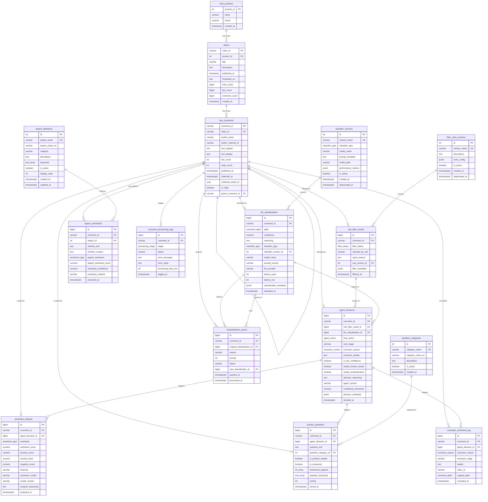
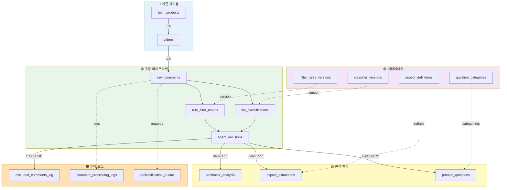
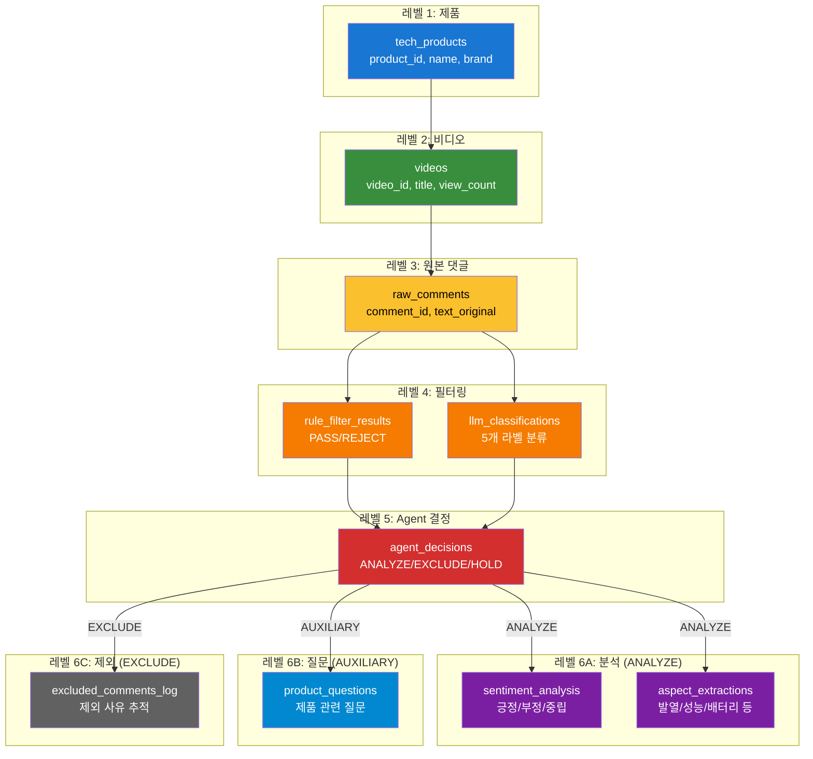
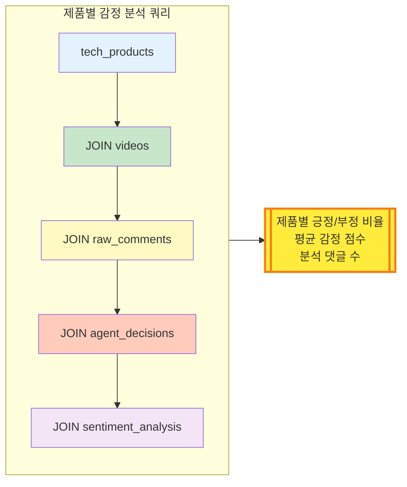

# 통합 DB 구조 ERD

## 전체 테이블 관계도

---

## 데이터 흐름도 (Flow Diagram)

---

## 계층 구조도 (Hierarchy)

---

## 제품별 분석 조인 경로

---

## 테이블별 색상 범례

| 색상 | 카테고리 | 테이블 |
|------|----------|--------|
| 🔵 **파란색** | 기존 테이블 | tech_products, videos |
| 🟢 **초록색** | 댓글 파이프라인 | raw_comments, rule_filter_results, llm_classifications, agent_decisions |
| 🟡 **노란색** | 분석 결과 | sentiment_analysis, aspect_extractions, product_questions |
| 🟣 **보라색** | 메타데이터 | aspect_definitions, question_categories, filter_rules_versions, classifier_versions |
| 🟠 **주황색** | 추적/로그 | excluded_comments_log, comment_processing_logs, reclassification_queue |

---

## 주요 관계 요약

### 1:N 관계
- `tech_products` (1) ↔ `videos` (N)
- `videos` (1) ↔ `raw_comments` (N)
- `raw_comments` (1) ↔ `rule_filter_results` (1)
- `raw_comments` (1) ↔ `llm_classifications` (1)
- `raw_comments` (1) ↔ `agent_decisions` (1)
- `raw_comments` (1) ↔ `aspect_extractions` (N)

### 버전 관리
- `filter_rules_versions` → `rule_filter_results`
- `classifier_versions` → `llm_classifications`

### 정의 참조
- `aspect_definitions` → `aspect_extractions`
- `question_categories` → `product_questions`

### 추적
- `agent_decisions` → `sentiment_analysis` (1:1)
- `agent_decisions` → `product_questions` (1:1)
- `agent_decisions` → `excluded_comments_log` (1:N)

---

## 전체 테이블 개수

| 카테고리 | 개수 | 테이블 목록 |
|---------|------|------------|
| **기존** | 2 | tech_products, videos |
| **Core** | 4 | raw_comments, rule_filter_results, llm_classifications, agent_decisions |
| **Analysis** | 3 | sentiment_analysis, aspect_extractions, product_questions |
| **Metadata** | 4 | aspect_definitions, question_categories, filter_rules_versions, classifier_versions |
| **Tracking** | 3 | excluded_comments_log, comment_processing_logs, reclassification_queue |
| **뷰** | 4 | v_product_comprehensive_analysis, v_video_sentiment_summary, v_aspect_analysis_by_product, v_filter_performance |
| **합계** | **16 테이블 + 4 뷰** | **총 20개** |
