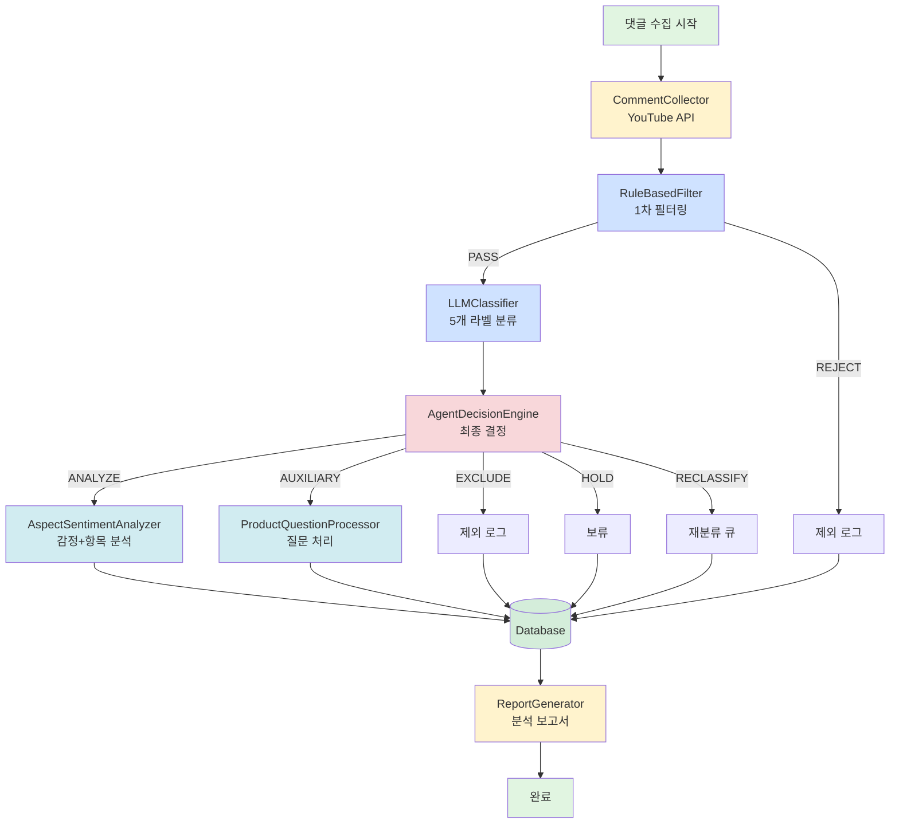

# 댓글 분석 파이프라인 아키텍처

## 전체 구조도



---

## 계층 구조

```
┌─────────────────────────────────────────────────────────┐
│                   Pipeline Runner                       │
│                  (pipeline_runner.py)                   │
└─────────────────────────────────────────────────────────┘
                            ↓
┌─────────────────────────────────────────────────────────┐
│              Pipeline Orchestrator                      │
│          (services/pipeline_orchestrator.py)            │
│  - 전체 파이프라인 흐름 제어                              │
│  - 각 단계 조율                                          │
│  - 에러 처리 및 재시도                                   │
└─────────────────────────────────────────────────────────┘
                            ↓
┌─────────────────────────────────────────────────────────┐
│                   Service Layer                         │
├─────────────────────────────────────────────────────────┤
│  CommentCollector      → YouTube API 댓글 수집           │
│  DBService             → 데이터베이스 저장               │
│  ReportGenerator       → 분석 보고서 생성                │
└─────────────────────────────────────────────────────────┘
                            ↓
┌─────────────────────────────────────────────────────────┐
│                  Processing Layer                       │
├─────────────────────────────────────────────────────────┤
│  RuleBasedFilter       → 1차 규칙 필터                   │
│  GroqClassifier        → 2차 LLM 분류                    │
│  AgentDecisionEngine   → 최종 결정                       │
│  AspectSentimentAnalyzer → 감정 분석                     │
│  ProductQuestionProcessor → 질문 처리                    │
└─────────────────────────────────────────────────────────┘
                            ↓
┌─────────────────────────────────────────────────────────┐
│                   Data Layer                            │
│                 (PostgreSQL)                            │
└─────────────────────────────────────────────────────────┘
```

---

## 데이터 흐름

```
[YouTube Video]
       ↓
[1. 댓글 수집]
   - raw_comments 테이블 저장
   - 중복 방지 (comment_id unique)
       ↓
[2. 1차 규칙 필터]
   - rule_filter_results 테이블 저장
   - PASS → 다음 단계
   - REJECT → excluded_comments_log
       ↓
[3. LLM 분류]
   - llm_classifications 테이블 저장
   - 5개 라벨 분류
       ↓
[4. Agent 결정]
   - agent_decisions 테이블 저장
   - ANALYZE → 감정 분석
   - AUXILIARY_STORE → 질문 처리
   - EXCLUDE → 제외 로그
   - HOLD → 보류
   - RECLASSIFY → 재분류 큐
       ↓
[5a. 감정 분석] (ANALYZE)
   - sentiment_analysis 테이블
   - aspect_extractions 테이블
       ↓
[5b. 질문 처리] (AUXILIARY_STORE)
   - product_questions 테이블
       ↓
[6. 보고서 생성]
   - 뷰 쿼리 (v_product_comprehensive_analysis)
   - JSON/HTML 보고서 생성
```

---

## 클래스 다이어그램

```
PipelineOrchestrator
├── CommentCollector
│   └── YouTube API Client
├── RuleBasedFilter
│   └── 11 filtering rules
├── GroqClassifier
│   ├── PromptBuilder
│   └── Groq API Client
├── AgentDecisionEngine
│   └── PolicyConfig
├── AspectSentimentAnalyzer
│   └── Groq API Client
├── ProductQuestionProcessor
│   └── Groq API Client
├── DBService
│   └── psycopg2 / SQLAlchemy
└── ReportGenerator
    └── 보고서 템플릿
```

---

## 주요 클래스 책임

### 1. PipelineOrchestrator
**책임**: 전체 파이프라인 조율
- 각 단계 순차 실행
- 단계 간 데이터 전달
- 에러 처리 및 재시도
- 로깅 및 진행 상태 추적

### 2. CommentCollector
**책임**: YouTube 댓글 수집
- YouTube Data API v3 호출
- 페이지네이션 처리
- 중복 방지
- 수집 배치 ID 생성

### 3. DBService
**책임**: 데이터베이스 CRUD
- raw_comments 저장
- filter_results 저장
- classifications 저장
- decisions 저장
- analysis 저장
- 트랜잭션 관리

### 4. ReportGenerator
**책임**: 분석 보고서 생성
- DB 뷰 쿼리
- 통계 계산
- JSON/HTML 보고서 생성
- 차트 생성 (선택)

---

## 단계별 처리 흐름

### Stage 1: 수집 (Collection)
```python
comments = collector.collect_comments(video_id)
db.save_raw_comments(comments)
```

### Stage 2: 1차 필터 (Rule Filter)
```python
for comment in comments:
    filter_result = rule_filter.filter_single(comment)
    db.save_filter_result(filter_result)
    
    if filter_result.is_passed:
        passed_comments.append(comment)
```

### Stage 3: 2차 분류 (LLM Classification)
```python
for comment in passed_comments:
    classification = classifier.classify_single(comment)
    db.save_classification(classification)
```

### Stage 4: Agent 결정 (Agent Decision)
```python
for comment in passed_comments:
    decision = agent.decide(comment, filter_result, classification)
    db.save_decision(decision)
    
    if decision.final_action == "ANALYZE":
        analyze_queue.append(comment)
    elif decision.final_action == "AUXILIARY_STORE":
        question_queue.append(comment)
```

### Stage 5a: 감정 분석 (Sentiment Analysis)
```python
for comment in analyze_queue:
    sentiment = sentiment_analyzer.analyze_single(comment)
    db.save_sentiment(sentiment)
```

### Stage 5b: 질문 처리 (Question Processing)
```python
for comment in question_queue:
    question = question_processor.process_single(comment)
    if question.is_product_related:
        db.save_question(question)
```

### Stage 6: 보고서 생성 (Report Generation)
```python
report = report_generator.generate(video_id)
report.save_json()
report.save_html()
```

---

## 예외 처리 전략

### 1. 단계별 예외 처리
```python
try:
    result = process_stage(data)
except APIError as e:
    logger.error(f"API 에러: {e}")
    # 재시도 또는 스킵
except ValidationError as e:
    logger.error(f"검증 에러: {e}")
    # 데이터 보정 또는 스킵
except Exception as e:
    logger.error(f"예상치 못한 에러: {e}")
    # 안전하게 종료
```

### 2. 재시도 전략
```python
@retry(max_attempts=3, delay=1.0, backoff=2.0)
def call_api():
    # API 호출
    pass
```

### 3. 부분 실패 처리
```python
# 배치 처리 시 일부 실패해도 계속 진행
for item in batch:
    try:
        process(item)
    except Exception as e:
        logger.error(f"Item {item.id} 처리 실패: {e}")
        failed_items.append(item)
        continue  # 다음 아이템 처리
```

---

## 로깅 전략

### 1. 계층별 로그
```
[INFO] Pipeline started: video_id=xyz123
[INFO] Stage 1: Collecting comments...
[INFO] Collected 247 comments
[INFO] Stage 2: Rule filtering...
[INFO] Passed: 189, Rejected: 58
[INFO] Stage 3: LLM classification...
[WARN] Classification retry 1/3 for comment abc
[INFO] Classified: 189 comments
[INFO] Stage 4: Agent decision...
[INFO] ANALYZE: 142, AUXILIARY: 28, EXCLUDE: 19
[INFO] Stage 5a: Sentiment analysis...
[INFO] Analyzed: 142 comments
[INFO] Stage 5b: Question processing...
[INFO] Processed: 28 questions
[INFO] Stage 6: Report generation...
[INFO] Report saved: reports/xyz123_report.json
[INFO] Pipeline completed in 127.3s
```

### 2. 로그 레벨
- **DEBUG**: 상세한 디버그 정보
- **INFO**: 일반 진행 상황
- **WARNING**: 경고 (재시도, 스킵 등)
- **ERROR**: 에러 (복구 가능)
- **CRITICAL**: 치명적 에러 (복구 불가)

### 3. 로그 저장
```python
import logging

logging.basicConfig(
    level=logging.INFO,
    format='%(asctime)s [%(levelname)s] %(name)s: %(message)s',
    handlers=[
        logging.FileHandler('pipeline.log'),
        logging.StreamHandler()
    ]
)
```

---

## 재처리 전략

### 1. 댓글 단위 재처리
```python
# 특정 댓글만 재처리
pipeline.reprocess_comments(comment_ids=['abc', 'def'])
```

### 2. 단계별 재처리
```python
# 특정 단계부터 재시작
pipeline.run_from_stage(video_id, start_stage='classification')
```

### 3. 실패 아이템 재처리
```python
# 실패한 아이템만 재처리
failed_items = db.get_failed_items(video_id)
pipeline.reprocess_batch(failed_items)
```

---

## Airflow 호환 설계

### DAG 구조
```python
from airflow import DAG
from airflow.operators.python import PythonOperator

with DAG('comment_analysis', schedule_interval='@daily') as dag:
    
    collect = PythonOperator(
        task_id='collect_comments',
        python_callable=collect_comments_task
    )
    
    filter_task = PythonOperator(
        task_id='rule_filter',
        python_callable=rule_filter_task
    )
    
    classify = PythonOperator(
        task_id='llm_classify',
        python_callable=classify_task
    )
    
    decide = PythonOperator(
        task_id='agent_decide',
        python_callable=decide_task
    )
    
    analyze = PythonOperator(
        task_id='sentiment_analyze',
        python_callable=analyze_task
    )
    
    report = PythonOperator(
        task_id='generate_report',
        python_callable=report_task
    )
    
    collect >> filter_task >> classify >> decide >> analyze >> report
```

---

## 성능 최적화

### 1. 배치 처리
```python
# 100개씩 배치 처리
BATCH_SIZE = 100
for i in range(0, len(comments), BATCH_SIZE):
    batch = comments[i:i+BATCH_SIZE]
    process_batch(batch)
```

### 2. 병렬 처리
```python
from concurrent.futures import ThreadPoolExecutor

with ThreadPoolExecutor(max_workers=5) as executor:
    results = executor.map(process_comment, comments)
```

### 3. 캐싱
```python
# LRU 캐시 사용
from functools import lru_cache

@lru_cache(maxsize=1000)
def get_aspect_definition(aspect_name):
    return db.query_aspect(aspect_name)
```

---

## 모니터링 포인트

### 1. 처리 시간
- 단계별 소요 시간
- 전체 파이프라인 시간
- API 호출 지연

### 2. 처리량
- 초당 댓글 처리 수
- 배치 크기
- 병렬 처리 수

### 3. 에러율
- 단계별 실패율
- API 에러율
- 재시도 횟수

### 4. 비용
- LLM API 호출 비용
- 토큰 사용량
- DB 저장 용량

---

## 설정 관리

### config.yaml
```yaml
pipeline:
  batch_size: 100
  max_workers: 5
  retry:
    max_attempts: 3
    delay: 1.0
    backoff: 2.0

youtube:
  api_key: ${YOUTUBE_API_KEY}
  max_results: 100

llm:
  api_key: ${GROQ_API_KEY}
  model: llama-3.3-70b-versatile
  temperature: 0.1

database:
  host: localhost
  port: 5432
  name: comment_analysis
  user: ${DB_USER}
  password: ${DB_PASSWORD}

logging:
  level: INFO
  file: pipeline.log
```

---

## 요약

| 컴포넌트 | 책임 | 출력 |
|---------|------|------|
| **CommentCollector** | YouTube 댓글 수집 | raw_comments |
| **RuleBasedFilter** | 1차 필터링 | filter_results |
| **GroqClassifier** | 2차 LLM 분류 | classifications |
| **AgentDecisionEngine** | 최종 결정 | decisions |
| **AspectSentimentAnalyzer** | 감정 분석 | sentiment + aspects |
| **ProductQuestionProcessor** | 질문 처리 | questions |
| **DBService** | 데이터 저장 | DB records |
| **ReportGenerator** | 보고서 생성 | JSON/HTML |

**전체 파이프라인**: 수집 → 필터 → 분류 → 결정 → 분석 → 저장 → 보고서
